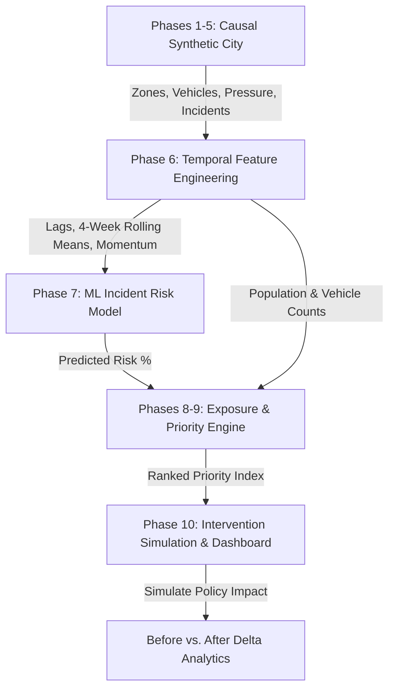

# 🚦 Traffic Intelligence & Intervention Priority System

An end-to-end urban traffic simulation, machine learning risk modeling, exposure-weighted priority scoring, and counterfactual policy impact simulator.

Built for municipal authorities with constrained weekly enforcement resources (police patrols, adaptive signal timing, emergency dispatch).

---

## 💡 Core Philosophy: `Risk ≠ Exposure ≠ Priority`

Traditional systems prioritize intersections solely on historical incident counts or raw accident probability. This system operationalizes three distinct pillars:

| Pillar | Core Question | Formula / Concept |
| :--- | :--- | :--- |
| **Risk** | *How likely is an incident?* | $P(\text{Incident} \mid \text{Congestion, Speed, Violations, Weather, Events, History})$ |
| **Exposure** | *How many citizens & vehicles are exposed?* | $w_{\text{pop}} \cdot \text{Norm}(\text{Population}) + w_{\text{veh}} \cdot \text{Norm}(\text{Vehicles})$ |
| **Priority** | *Where should limited resources intervene first?* | $w_r \cdot \text{Risk} + w_e \cdot \text{Exposure} + w_t \cdot \text{Trend}$ |

> **Example**: A rural road with 75% risk but 50 vehicles/day has lower priority than an arterial transit hub with 60% risk and 15,000 citizens/vehicles exposed.

---

## 🏗️ 10-Phase Technical Pipeline



1. **Phase 1 (Urban Infrastructure)**: Generates $N$ static urban zones with baseline population density, road network capacity, and archetypes (Commercial, Residential, Transit Hub, Mixed Industrial).
2. **Phase 2 (Vehicle Dynamics)**: Simulates vehicle demand correlated with population, zone activity factors, event surges, and weekly variance.
3. **Phase 3 (Traffic Physics & Pressure)**: Derives pressure ratio ($\frac{\text{Vehicles}}{\text{Capacity}}$), non-linear congestion indices (0–100), speed degradation curves, and violation Poisson counts.
4. **Phase 4 (Environmental Disturbances)**: Injects stochastic weather conditions (Clear, Rain, Heavy Rain, Fog) and special events (Festivals, Roadwork).
5. **Phase 5 (Stochastic Incident Generation)**: Simulates latent log-odds incident risk and Bernoulli event realizations with realistic real-world noise.
6. **Phase 6 (Temporal & Trend Engineering)**: Constructs historical lag features ($t-1$), 4-week rolling means, congestion deltas, and polynomial trend slopes (Increasing / Decreasing / Stable) with zero data leakage.
7. **Phase 7 (ML Incident Risk Prediction)**: Trains a calibrated supervised ensemble (`RandomForestClassifier`) evaluated via holdout ROC-AUC, Brier Loss, and Precision/Recall.
8. **Phase 8 (Exposure Normalization)**: Computes weighted citizen and vehicle exposure scores ($0 - 100$).
9. **Phase 9 (Actionable Priority Engine)**: Computes composite priority scores and categorizes corridors into `CRITICAL`, `VERY HIGH`, `HIGH`, or `MODERATE` tiers.
10. **Phase 10 (Intervention Simulation & Executive Dashboard)**: Recommends targeted municipal policies (Adaptive Signal Timing, Targeted Police Patrols, Dynamic Lane Flow) and evaluates counterfactual before vs. after metrics.

---

## 🚀 Quick Start

### 1. Installation
```bash
pip install -r requirements.txt
```

### 2. Run the End-to-End Simulation
```bash
python sim.py
```

---

## 📊 Sample Executive Dashboard Output

```
============================================================================
============= WEEKLY TRAFFIC INTELLIGENCE BRIEFING -- WEEK 24 ==============
============================================================================

[+] SYSTEM METRICS & ML CALIBRATION:
    - Holdout ROC-AUC: 0.793 | Accuracy: 71.7% | Brier Loss: 0.185
    - Evaluated Zones: 20 | Total Active Traffic Corridors Monitored: 20
    - Core Engine: Risk (Probability) x Exposure (Volume) x Trend (Momentum) -> Priority Index

----------------------------------------------------------------------------
RANK  ZONE      ARCHETYPE      RISK (%)   EXPOSURE   TREND       PRIORITY   TIER
----------------------------------------------------------------------------
1     Zone_09   Residential      97.2%      72.0   = Stab         81.4   [CRITICAL]
2     Zone_03   Residential      84.3%      68.8   ^ Incr         80.5   [CRITICAL]
3     Zone_20   Commercial       83.8%      81.0   ^ Incr         79.8   [VERY HIGH]
4     Zone_08   Mixed_Industrial 83.1%      68.8   ^ Incr         79.4   [VERY HIGH]
5     Zone_16   Transit_Hub      95.2%      62.7   = Stab         77.0   [VERY HIGH]
----------------------------------------------------------------------------

============================================================================
================== COUNTERFACTUAL INTERVENTION SIMULATION ==================
============================================================================

[>] TARGETED ZONE: Zone_09
    Selected Policy: Targeted Traffic Police & Speed Enforcement
    Mechanism:       Deploys visible patrol units to curb aggressive driving and violations.

    --------------------------------------------------------------
    METRIC               BEFORE       AFTER        IMPACT / DELTA
    --------------------------------------------------------------
    Congestion Index     100.0%        92.0%       -8.0%
    Average Speed         14.6 km/h    16.6 km/h   +2.0 km/h
    Violations / Wk         11             5         -6
    Incident Risk         97.2%        78.9%       -18.3% (Predicted)
    Priority Score        81.4         43.9        -37.5 (CRITICAL -> MODERATE)
    --------------------------------------------------------------
    Result: Zone risk successfully mitigated below critical intervention threshold.
```

---

## 📁 Repository Structure

```
traffic_sim/
├── config.py         # Simulation parameters, weights, and hyperparameter constants
├── simulation.py     # Phases 1-5: City generator, traffic physics, weather, stochastic incidents
├── features.py       # Phase 6: Rolling windows, lag indicators, trend momentum
├── model.py          # Phase 7: ML Risk model training & calibrated probability estimation
├── scoring.py        # Phases 8-9: Exposure index and multi-factor Priority engine
├── intervention.py   # Phase 10a: Counterfactual policy impact simulator
├── dashboard.py      # Phase 10b: Executive terminal briefing & visualizer
├── sim.py            # Main entrypoint pipeline
└── requirements.txt  # Dependencies (numpy, pandas, scikit-learn)
```
